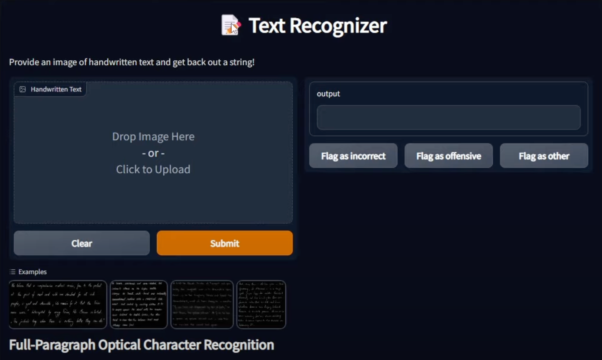

Implements a text recognizer using a modern DL stack:

- Code quality assurance with pre-commit hooks, GitHub Actions, and pytest
- Real data augmented with data synthesis
- Image encoding via a CNN architecture
- Decoding to text via a Transformer architecture
- Model implementation in PyTorch
- Model training and basic tracking and metrics via PyTorch Lightning and torchmetrics
- Experiment tracking, hyperparameter tuning, and model versioning with W&B
- Model packaging in TorchScript
- Predictor backend containerization via Docker and deployment as a microservice on AWS Lambda
- Basic load testing with Locust
- Pure Python frontend web application in Gradio
- Model monitoring with Gantry
